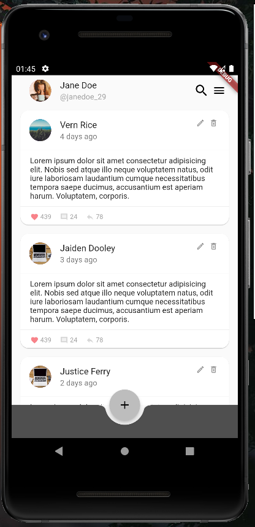
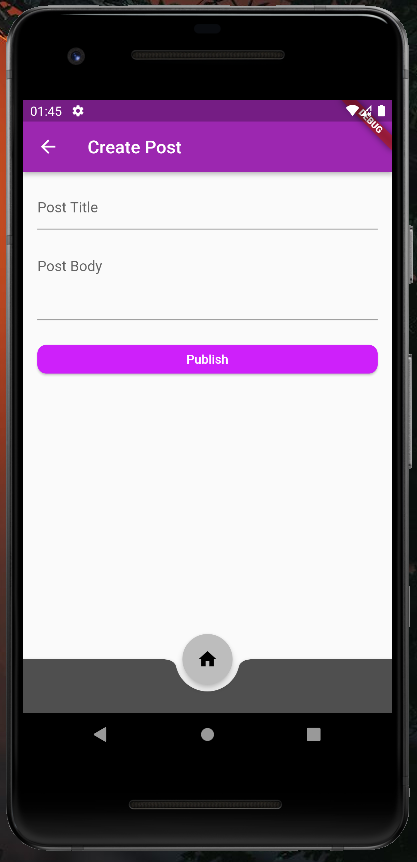

# Flutter Test Project

Test project for showing posts from an external API. Data and state handled with Bloc Pattern. It uses json-server mock API.

# Images
<p align="center">



</p>
## Check my answers for questions

[Go to answers](Questions.md)

---
## Getting Started

**To use mock API install package;**
```
npm i json-server -g
```
**To run mock API locally;**
``` 
json-server --watch db.json
```
> You need to have json server running in order for the app to work
For help getting started with Flutter, view our
[online documentation](https://flutter.dev/docs), which offers tutorials,
samples, guidance on mobile development, and a full API reference.
